<h2 align="center">Vinícius F. G. Araújo</h2>

🚀 Software Developer | 💻 Computer Networks | 🤖 Embedded Systems & Robotics | 🐧 Linux

## Sobre mim

🎓 Estudante de Sistemas de Informação - IF Goiano  
🔬 Pesquisador em cultura maker, impressão 3D e robótica  
🚜 Desenvolvendo veículo autônomo para agricultura  
💡 Interesse em IA aplicada, visão computacional e automação  

## 📊 Estatísticas do GitHub

  

## 🧰 Tecnologias e Ferramentas
 
 
 
 
 
 
 
 
 
 

## 🚀 Projetos 

♟️ Xadrez *(em desenvolvimento)*  
→ Lógica do jogo, validação de movimentos e interface gráfica  
**Stack:** Java / Maven / JavaFX  

🤖 Veículo Autônomo Agrícola *(em desenvolvimento)*  
→ Navegação com sensores e visão computacional  
**Stack:** Python / CNN / Raspberry Pi / Arduino  

<!-- COBRINHA -->
<picture>
  <source media="(prefers-color-scheme: dark)" srcset="https://raw.githubusercontent.com/viniciusfga/viniciusfga/output/github-contribution-grid-snake-dark.svg">
  <source media="(prefers-color-scheme: light)" srcset="https://raw.githubusercontent.com/viniciusfga/viniciusfga/output/github-contribution-grid-snake.svg">
  
</picture>
